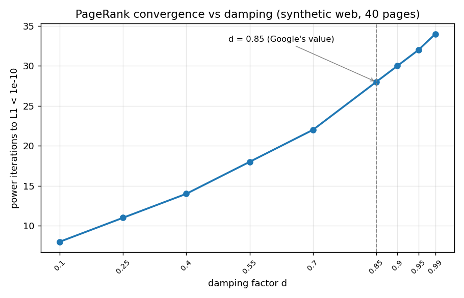

# Mini Search Engine

[](https://github.com/zyx100089-eng/mini-search-engine/actions/workflows/tests.yml)
[](https://www.python.org)
[](LICENSE)

A small search engine I built to understand what actually happens
between typing a query and getting results: a polite web crawler, a
sparse (CSR) web graph, PageRank via power iteration, and a
TF-IDF × PageRank ranking blend.

## The question I started with

Every search explanation says "PageRank is the stationary distribution
of a Markov chain over the web". I could recite that sentence but
couldn't have implemented it. So the project's test was: can I go from
the 1998 paper to working code that indexes pages, ranks them, and
answers queries — without copying a tutorial?

## What I built

| Piece | What it does | The detail I'm proudest of |
|---|---|---|
| `sparse.py` | CSR matrix: `from_coo`, `matvec`, `matvec_T`, row sums, density | PageRank's power iteration needs a transposed matvec; single pass over nonzeros, no dense matrix anywhere |
| `crawl.py` | `synthetic_web()` (deterministic web-like graph: communities, hubs, authorities, sinks) + `PoliteCrawler` for real crawling | Deferred link resolution — links to not-yet-queued pages are kept, not dropped |
| `pagerank.py` | Power iteration with damping `d`, teleportation, L1 convergence, sink handling | Sink handling: mass on out-degree-0 pages is redistributed uniformly, or it silently leaks out of the chain |
| `search.py` | Inverted index, tokenisation + stopwords, TF-IDF, `beta`-controlled PageRank blend, query-term snippets | The `beta` knob makes the ranking blend explicit and testable |
| `verify.py` | CSR vs dense NumPy, PageRank vs independent dense reference, distribution checks, known-graph checks, damping convergence-rate check, search-ranking checks | Everything checked against an independent reference, not just self-consistency |
| `test_search.py` | 29 unit tests, including the crawler against a mocked network | The crawler is tested without touching the network |
| `demo.py` | The whole pipeline as a walkthrough | Random surfer → CSR → power iteration → the graph → search blending |

## The maths, in one paragraph

PageRank models a random surfer who follows outbound links uniformly
at random and occasionally teleports to an arbitrary page. The ranks
are the stationary distribution of that Markov chain. The damping
factor `d` is what makes the chain irreducible and aperiodic — without
teleportation, unreachable pages would have no rank at all. The
implementation is a power iteration: `π_{k+1} = d·Aᵀπ_k + (1-d)/N`,
stopping when ‖π_{k+1} − π_k‖₁ < 1e-10.

## Results I trust

- PageRank matches an independent dense NumPy implementation on 20
  random graphs (atol 1e-10); sum(π) == 1 exactly to float precision.
- **Convergence follows the spectral radius**: on the synthetic web
  (40 pages), `d=0.1` converges in 8 iterations and `d=0.99` in 34
  (1e-10 tolerance). `verify.py` measures the same effect on a 5-node
  chain (9 and 61 iterations). The gap is the spectral gap of the
  damped chain — the second eigenvalue d·λ₂(A) — measured rather than
  asserted.



*Synthetic web (40 pages, tol 1e-10). The error contracts by a factor
|λ₂| per iteration, where |λ₂| = d·λ₂(A) is the second eigenvalue of
the damped matrix, so the iteration count scales like
log(tol)/log(d·λ₂(A)). The measured curve matches that prediction —
e.g. d=0.99 gives |λ₂| = 0.495, predicting ~33 iterations vs the 34
measured.*
- On the synthetic web (40 pages, 120 links): authorities (in-degree
  18–23) dominate rank; hubs (out-degree 13–14) give rank away; sinks
  do not trap it.
- Search: topic queries rank their topic's pages first; the PageRank
  prior visibly changes the winner (query "caesar legion" promotes the
  Ancient-Rome authority page over its siblings).

## What search looks like

`python3 demo.py` runs the whole pipeline; the search section shows
the TF-IDF × PageRank blend in action:

```
query: 'caesar legion'
  Ancient Rome #15    tfidf=0.533  rank=0.2650  score=0.798
     About ancient rome. empire senate **caesar** **legion** provinces aqueducts gladiators
  Ancient Rome #12    tfidf=0.533  rank=0.0049  score=0.538
     About ancient rome. empire senate **caesar** **legion** provinces aqueducts gladiators
  Ancient Rome #13    tfidf=0.533  rank=0.0048  score=0.538
     About ancient rome. empire senate **caesar** **legion** provinces aqueducts gladiators
```

All three pages match the query equally well (same tfidf) — the
authority page `#15` wins because the network endorses it (rank
0.265 vs 0.005). Without the PageRank blend (`beta=0.0`) the winner
is `#0`; with it, `#15` — the query where the two signals disagree,
and the blend resolves it.

## A real crawl

The synthetic web is the reproducible core, but the crawler also works
on real sites. `crawl_real.py` crawled 25 pages / 1071 links from
imperial.ac.uk, and the committed `data/real_crawl.json` is ranked
and searchable with the same pipeline. (Scope: a large crawl needs
robots.txt, rate limits, and storage — that's engineering beyond this
project, so the synthetic web stayed the honest main dataset.)

## What I'd do differently

- **Crawl something real at scale.** The polite crawler works, and a
  bounded real crawl is committed — but the experiments still mostly
  run on the synthetic web.
- **Query understanding.** No query expansion, no synonyms, no
  stemming beyond a naive suffix strip.
- **Blocking.** PageRank on the synthetic web is fine as an algorithm
  demonstration; Google's block-rank was a later paper and it's where
  the real engineering lives.

## Reading list

- Page, Brin, Motwani, Winograd, *The PageRank Citation Ranking:
  Bringing Order to the Web* (1998)
- Langville & Meyer, *Google's PageRank and Beyond: The Science of
  Search Engine Rankings* (2006) — I found this after the project was
  working; the convergence-rate section confirmed what I'd measured.

## Running

```
python3 -m pytest test_search.py -q   # unit tests
python3 verify.py                     # full verification
python3 demo.py                       # demonstration
python3 crawl_real.py --seeds https://www.imperial.ac.uk/mathematics/ --max-pages 25
```
